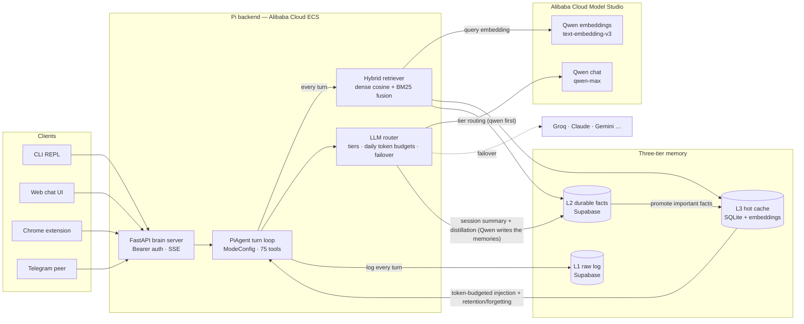

# Pi — Autonomous Intelligence Agent

> **🏆 Global AI Hackathon with Qwen Cloud — Track 1: MemoryAgent.**
> Pi is a personal agent with persistent three-tier memory (raw log → distilled facts → token-budgeted hot cache), cross-session recall, and timely forgetting via retention policies. LLM calls route through [Qwen on Alibaba Cloud Model Studio (DashScope)](core/providers/qwen.py) — that provider file is the Alibaba Cloud proof-of-use. Quickstart below boots with a `QWEN_API_KEY` alone.

Pi is a self-improving agent system built on a multi-provider LLM router (Qwen, Claude, Groq, Gemini, +more), with a continuous engineering loop:

> build → test → ticket → run → inspect → detect → build again

Every fix produces a ticket. Every ticket produces a solution record. Every recurring failure becomes a lesson. The goal: Pi runs the engineering loop on its own.

**Phase 9 (distributed) complete** — Pi now runs a local brain server (FastAPI, port 7712), a dark web chat UI, a Chrome MV3 browser extension, and handles Telegram as a bidirectional peer with per-chat conversation isolation.

---

## Architecture



**The Track-1 story in one line:** Qwen thinks, Qwen summarizes, Qwen embeds — and the
three-tier memory decides what's worth keeping, what surfaces into a limited context
window, and what gets forgotten.

---

## Quick start

```bash
pip install -r requirements.txt
cp .env.example .env          # fill in API keys (see below)
python pi_agent.py
```

**Minimum to boot**: any ONE provider key. For the hackathon build that's `QWEN_API_KEY`
([get one from Alibaba Cloud Model Studio](https://bit.ly/qwencloud-getapi)) — the router
only needs a single provider, and L3 memory runs on local SQLite with no cloud database.

**Full setup**: `ANTHROPIC_API_KEY`, `GROQ_API_KEY`, plus `SUPABASE_URL` + `SUPABASE_KEY`
for the L1/L2 memory tiers (run `SUPABASE_SETUP.sql` in your Supabase SQL editor). Without
Supabase, L1/L2 degrade gracefully to no-ops and L3 keeps working.

**Optional**: `GEMINI_API_KEY` (research-mode 3rd agent + Imagen image backend), `TELEGRAM_BOT_TOKEN` + `TELEGRAM_CHAT_ID` (bidirectional Telegram peer + watcher/sprint alerts), `PI_HTTP_TOKEN` (brain server Bearer auth — generate any random string), `PI_HTTP_PORT` (default 7712), `REPLICATE_API_TOKEN` (video generation, falls back to HuggingFace)

Full setup: [docs/USER_GUIDE.md](docs/USER_GUIDE.md)

---

## Modes

| Mode | Model | Cost | Use for |
| --- | --- | --- | --- |
| **root** | Claude Sonnet 4.6 | ~$0.003–0.01/msg | Code edits, file ops, full tool loop (~75 tools) |
| **normie** | Groq Llama 3.3 70B | Free | Fast chat, no tools |
| **research** | Claude + Groq + Gemini | ~$0.02/run | Hard questions, multi-agent debate |

Switch by typing: `root mode`, `normie`, `research mode`.

---

## Tools — ~75 total (root mode)

The auto-regenerated inventory in [PI.md §7](PI.md) is the source of truth (hand-copied tool tables rot — this README deliberately doesn't keep one). Categories: memory · execution · awareness · project · web · Obsidian · image (pollinations / FLUX / Gemini-Imagen) · video · Gmail (**`gmail_send` creates drafts only — it never sends**) · Calendar · documents · faces · TTS/STT · Telegram (send, react, edit, buttons) · browser automation · computer control · watchers · research (`deep_debate`).

Each tool is a `ToolSpec` registered with `agent/tools.py` — adding a new tool is one entry in the owning module's `TOOLS = [...]` list, across 21 tool modules (see [docs/adr/002-tool-registry-pattern.md](docs/adr/002-tool-registry-pattern.md)).

---

## Memory architecture

Three tiers backed by Supabase + SQLite:

| Tier | Store | Contents | Access |
| --- | --- | --- | --- |
| **L1** `raw_wiki` | Supabase | Full conversation log, every turn, both modes | Archive; opt-in search |
| **L2** `organized_memory` | Supabase | Distilled durable facts; Groq writes at session-end | On-call via `memory_read` |
| **L3** `l3_cache` | SQLite | Hot context; injected into system prompt every turn | Always-on (800-token budget) |

`memory_read` default: checks L3 first — returns immediately on hit. Falls back to L2 only if L3 has nothing. Every turn (all modes, all paths) also logs locally to `logs/turns.jsonl` — durable, offline-safe.

**Retrieval:** `MemoryTools.retrieve()` fuses dense cosine similarity (Qwen `text-embedding-v3` / Gemini embeddings) with BM25 lexical ranking across L3+L2, wired directly into the turn loop — every recall-shaped question runs it automatically, not just when the model chooses to call a tool. Proven on a paraphrase case with zero lexical overlap that keyword search misses entirely (`testing/test_hybrid_retriever.py`).

**Forgetting** is four soft, recoverable mechanisms — never a hard delete: scheduled expiry (explicit or auto-inferred from phrasing like "just for today"), neglect-based decay (daily, unpinned facts fade with disuse, access resets the clock), contradiction detection (lexical topic-matching **and** an LLM-adjudicated pass for implication-level conflicts an LLM alone can catch, e.g. "moved to Boston" vs. "apartment in Atlanta"), and semantic dedup. The whole lifecycle is visible in one command:

```bash
python scripts/memory_cli.py forgotten --days 7   # what was forgotten, when, and why
```

---

## Vault / Obsidian integration

`vault/` is a local Obsidian-compatible knowledge base that mirrors session state.

```text
vault/
  notes/            ← agent-written notes (tickets, status, sprints, retros)
  memory/           ← L2/L3 snapshots  [gitignored]
  notes/per-ticket/ ← one distilled brief per ticket  [gitignored]
```

**How it works:**

- Pi can read/write vault notes during a session via `obsidian_read/write/append/search` tools
- `sync_vault()` runs at session exit — one-way push from Supabase into `vault/`
- MCP Obsidian server (`tools/mcp_obsidian_server.py`) available as an alternative real-time bridge
- **VS Code graph view:** install the [Foam](https://foamresearch.io) extension (see [docs/vscode-setup.md](docs/vscode-setup.md)) for backlinks + graph across `PI.md`, `vault/`, `CHECKPOINTS/`, `docs/`

---

## Autonomy loop

```bash
python scripts/sprint.py --dry-run          # plan next ticket, no edits
python scripts/sprint.py --auto-implement   # full autonomous run
python scripts/plan_sprint.py               # Monday: set week goal in PI.md §3
python scripts/retro.py --stdout            # Friday: aggregate week stats
python scripts/refresh_pi.py               # regenerate PI.md auto-sections
```

`sprint.py` picks the highest-priority open ticket, runs Claude with the full tool loop, blocks edits to risk-flagged components without a diff-first gate, runs `verify.py`, commits to a branch, escalates via Telegram on failure.

---

## Phase 9 (Distributed) — complete

| Ticket | What shipped |
| --- | --- |
| T-186 | Multi-conversation persistence: `conversations` + `conversation_turns` SQLite tables; `resume`/`chats` REPL commands |
| T-205 | Episodic recall: `close_conversation(digest)` + `recall_episode(query)` tool + automatic prefetch triggers |
| T-187 | Brain server: FastAPI on 127.0.0.1:7712; Bearer auth; asyncio FIFO lock; SSE streaming; CORS for extension |
| T-189 | Web chat UI: dark single-page app at `GET /`; SSE token streaming; conversation sidebar; shared `web/chat.js` |
| T-190 | Chrome MV3 extension: side panel + "Ask Pi about this page" context menu; reuses `web/chat.js` |
| T-188 | Telegram peer: per-chat conversation isolation via `telegram:<chat_id>` IDs + `conversation_switch` helper |
| T-206 | Watchers v2: `analyze=True` routes watcher events through Pi conversation; 6/hour rate limit |
| T-257/T-258 | Gmail inbound watcher → Telegram triage buttons (Draft reply / Add to calendar / Ignore) → Gmail draft or Calendar event. Human-in-the-loop by construction: drafts never auto-send |
| T-165 | StorageBackend seam: `SQLiteStorageBackend` + `InMemoryStorageBackend`; memory layer fully testable without DB |
| T-173 | AwarenessCache extracted from `PiAgent`: 6 state attrs → `agent/awareness_cache.py`; `PiAgent` delegates |

---

## Hardening Track (Phase 8.5) — complete

Structural refactor between Phase 8 (Voice) and Phase 9 (Distributed). All 10 R-tickets closed.

| R# | Ticket | What |
| --- | --- | --- |
| R1 | [T-082](tickets/closed/T-082-r1-god-mode-collapse.json) | Parallel mode fork collapsed into one `ModeConfig` + unified `_respond_via_config`. ADR-001 |
| R2 | [T-083](tickets/closed/T-083-r2-tool-registry-and-consolidation.json) | 64 tools migrated to `ToolSpec` registry; `agent/tools.py` slimmed. [ADR-002](docs/adr/002-tool-registry-pattern.md) |
| R3 | [T-084](tickets/closed/T-084-r3-router-tier-and-tpd-budget.json) | `LLMRouter` tier matrix + per-provider TPD-budget brownout. [ADR-003](docs/adr/003-router-tier-and-tpd-budget.md) |
| R4 | [T-085](tickets/closed/T-085-r4-resumable-session-exit.json) | Session exit ≤3 ops, resumable via `data/session_exit_state.json`. [ADR-005](docs/adr/005-resumable-exit.md) |
| R5 | [T-086](tickets/closed/T-086-r5-sprint-god-isolation.json) | `sprint.py` private-path ticket isolation (mechanism since retired with the private mode) |
| R6 | [T-087](tickets/closed/T-087-r6-partition-recovery-prework.json) | Partition-recovery pre-work |
| R7 | [T-088](tickets/closed/T-088-r7-archive-selfmodifier.json) | Phase-5 SelfModifier class archived |
| R8 | [T-089](tickets/closed/T-089-r8-modeconfig-dataclass.json) | `ModeConfig` dataclass drives all 3 response paths. [ADR-004](docs/adr/004-modeconfig-unifies-response-paths.md) |
| R9 | [T-090](tickets/closed/T-090-r9-dropped-log-local-fallback.json) | Dropped-turn local fallback → `logs/dropped_turns.jsonl` |
| R10 | [T-091](tickets/closed/T-091-r10-l3-prompt-cache-segment.json) | 3-segment prompt cache: static / warm (L3) / dynamic |

The durable record of these decisions is the ADR set in [docs/adr/](docs/adr/).

---

## Engineering loop

| Stage | Location |
| --- | --- |
| Open tickets | [tickets/open/](tickets/open/) |
| Closed tickets | [tickets/closed/](tickets/closed/) |
| Solutions (S-NNN) | [solutions/SOLUTIONS.jsonl](solutions/SOLUTIONS.jsonl) |
| Current sprint + state | [PI.md](PI.md) |
| Last session exit | [CHECKPOINTS/current.md](CHECKPOINTS/current.md) |
| CI | `python scripts/verify.py` |

---

## Repo map

| Path | Role |
| --- | --- |
| [PI.md](PI.md) | Single bootstrap doc — AI sessions start here |
| [pi_agent.py](pi_agent.py) | Agent class, tool loop, mode switching |
| [agent/](agent/) | Tool dispatch, prompt builder, turn log, awareness cache, storage backend, conversation persistence |
| [tools/](tools/) | 21 tool modules |
| [prompts/consciousness.default.txt](prompts/consciousness.default.txt) | Pi's identity prompt (public default; a private `consciousness.txt` overrides it when present) |
| [app/server.py](app/server.py) | FastAPI brain server (127.0.0.1:7712) |
| [pi_daemon.py](pi_daemon.py) | Daemon entry point — starts agent + HTTP server |
| [web/](web/) | `index.html` + `chat.js` — shared web chat UI |
| [extension/](extension/) | Chrome MV3 extension (side panel + context menu) |
| [scripts/](scripts/) | `sprint.py`, `plan_sprint.py`, `retro.py`, `refresh_pi.py`, `verify.py` |
| [vault/](vault/) | Obsidian-compatible knowledge base |
| [CHECKPOINTS/](CHECKPOINTS/) | Per-session exit states |
| [tickets/](tickets/) | Open + closed ticket queue |
| [solutions/SOLUTIONS.jsonl](solutions/SOLUTIONS.jsonl) | Append-only solution record |
| [testing/](testing/) | 80+ test files across all components |
| [docs/](docs/) | Architecture, ADRs, user guide, feature list, changelog |
| [docs/_archive/](docs/_archive/) | Superseded phase-0 artifacts |
| [SUPABASE_SETUP.sql](SUPABASE_SETUP.sql) | Cloud schema |

---

## Testing

```bash
python scripts/verify.py    # full gate — must say PASS before any commit
pytest testing/ -v          # individual suites
```

`verify.py` = syntax check on every `.py` + bare-`except:` lint + all non-costly tests. Live result: [docs/STATUS.md](docs/STATUS.md) (auto-written every run — trust it over any count in this file). The same gate runs on GitHub Actions ([.github/workflows/verify.yml](.github/workflows/verify.yml)) on every push.

---

## Cost

Default daily limit: **$0.50** (`app/config.py`). At limit, root auto-switches to normie for the rest of the day.

---

## License

Apache-2.0 — see [LICENSE](LICENSE).
